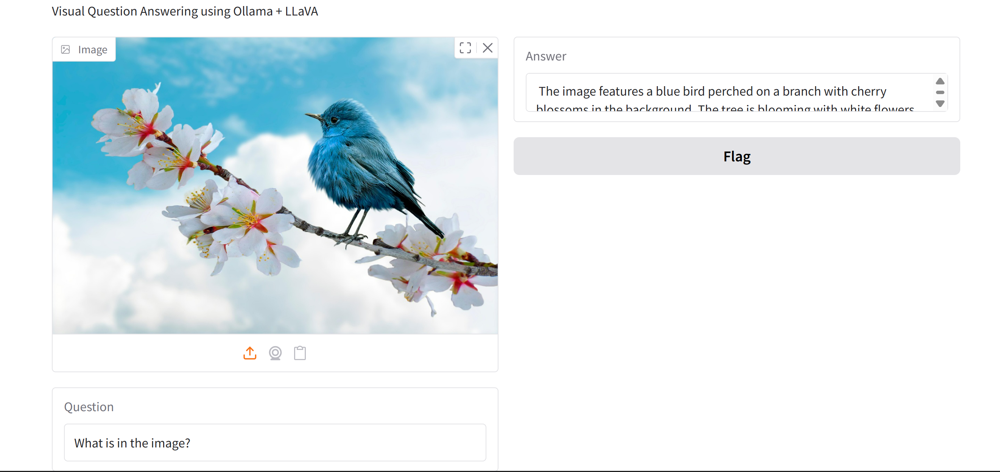

# Visual Question Answering (VQA) with Ollama

## Описание проекта

Данный проект представляет собой простое приложение для решения задачи Visual Question Answering (VQA) — ответа на вопрос по изображению.

Приложение реализовано на Python и запускается из Jupyter Notebook. В качестве графического интерфейса используется библиотека Gradio. Модель запускается локально через Ollama.

---

## Выбранная модель

Для решения задачи используется мультимодальная модель:

`llava` (LLaVA – Large Language and Vision Assistant)

### Причины выбора модели

* Поддерживает работу с изображениями и текстом
* Подходит для задачи VQA
* Может быть запущена локально
* Не требует дополнительного обучения

---

## Используемый промпт

В проекте используется простой текстовый промпт:

```
what is on the picture
```

## Пример работы

В реальном запросе к Ollama он передаётся вместе с изображением в формате chat-сообщения:

* изображение — как base64
* текст — как вопрос пользователя


Модель формирует ответ, опираясь исключительно на визуальное содержимое изображения.

 > The image features a blue bird perched on a branch with cherry blossoms in the background. The tree is blooming with white flowers, and there is a bright blue sky above. The scene gives a sense of spring or early spring season. 



---

## Ограничения модели

### Ограничения по входным данным

#### Изображения

* Поддерживается одно изображение за запрос
* Форматы: `PNG`, `JPG`, `JPEG`
* Изображение должно быть чётким и информативным

#### Текстовый вопрос

* Вопрос должен быть **коротким и конкретным**
* Лучше всего работает на **английском языке**
* Плохо справляется с:

  * абстрактными вопросами
  * сложными логическими рассуждениями
  * точным подсчётом большого количества объектов

### Ограничения модели в целом

* Возможны галлюцинации
* Ответы, как правило, краткие
* Точность ниже, чем у специализированных VQA-моделей (например, BLIP)
* Требует достаточного объёма оперативной памяти (8–16 GB)

